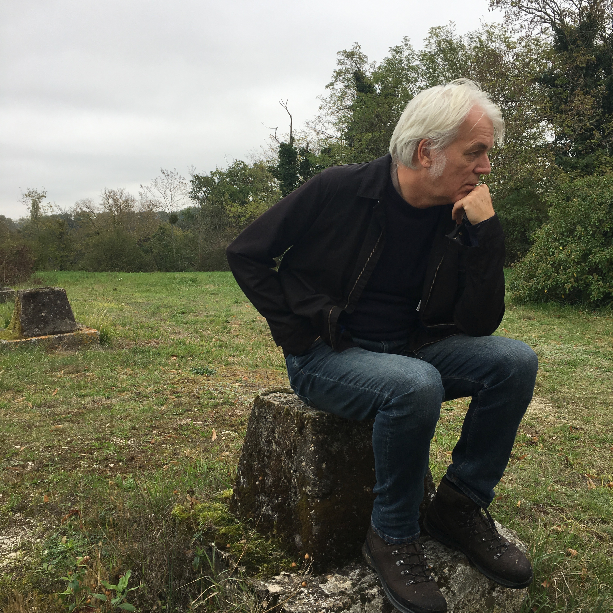

~~~
# ----------------------------------------
# contact.html
# ----------------------------------------
page = page.next
page.applyTemplate(template)  
page.name = 'Contact'
page.url = 'contact.html'

content = page.select('Content')
box = content.newBanner()
~~~
# Contact us for a free initial hangout

~~~
"""
from pagebot.constants import *
slideshow = content.newSlideShow(h=300, slideW='100%', slideH=300, startIndex=1, autoHeight=True, carousel=2, dynamicHeight=False, transition='slide', easing=CSS_EASE, frameDuration=4, duration=0.7, pauseOnHit=True, randomPlay=False)
box = slideshow.slides

#

#---
box = slideshow.side
#---

## What is your study?

Our experience and interest with design projects ranges from type design to exhibitions and from writing software to teaching.  

However, most importantly, the question is how that experience can help you to develop your own skills. Let us know what kind of design you would like to study, but never found the right time and space to start. 

# [Contact us](mailto:info@designdesign.space?subject=DesignDesign.Space%20Study%20Information)

"""

section = content.newSection()
box = section.newMain()
~~~

## Petr van Blokland

Petr van Blokland (1956) is the co-owner of Buro Petr van Blokland + Claudia Mens, founded in 1982. He graduated cum laude from the Royal Academy of Arts in The Hague in 1980 and studied Industrial Design at Delft Technical University. His special interest is in typography, type design, automation of the design process, theory and developing software tools. With Claudia Mens, he developed live design games at various art schools and conferences around the world and published columns in design magazines on various topics.

Van Blokland lectured at the Academy of Arts in Arnhem (1984 – 1989), at the Royal Academy of Arts in The Hague (1988 – present) and at the Master Institute of AKV St. Joost in Den Bosch (2010 - present).

Van Blokland received the Charles Peignot Award for typography of ATypI, the Association Typographique International, in 1988 and was Board Member from 1996 to 2003.

He was co-founder and CTO for The Health Agency, publisher of online health information, from 2001 to 2006. 

Besides lecturing, his current focus is on international projects, related to typography and type design. He also is co-founder of webtype.com and typenetwork.com, for which type design tools are developed. **Type Network** is also the location of his type foundry [TYPETR](http://typetr.typenetwork.com). The online study environment DesignDesign.Space started in 2017.

~~~
box = section.newSide()
~~~

* [E-mail buro@petr.com](mailto:buro@petr.com) 
* Mobile +31 6 24 219 502
* Line +31 15 887 1233 
* Address Rietveld 56, 2611 LM Delft NL
* Twitter @petrvanblokland
* [Instagram](https://www.instagram.com/petrvanblokland/)

~~~
box = section.newMain()
~~~
## About this site

This site is generated by [PageBot](https://GitHub.com/PageBot/PageBot/blob/master/README.md), using a single MarkDown file as source. Learning how that works can be the topic of a study.

## Trademarks

PageBot®, DesignDesign.Space®, Upgrade®, Bitcount® and PowerLift® are 2017+ registered trademarks by Buro Petr van Blokland + Claudia Mens, Delft, The Netherlands. 

~~~
box = section.newSide()
~~~

## Related links

* [designdesign.space](http://designdesign.space)
* [typetr.typenetwork.com](http://typetr.typenetwork.com)
* [upgrade.typenetwork.com](http://upgrade.typenetwork.com)
* [bitcount.typenetwork.com](http://bitcount.typenetwork.com)

### Tools

* [Skateboard](http://superpolator.com/pages/skateboard.html)
* [Superpolator](http://superpolator.com/pages/superpolator.html)
* [RoboFont](https://robofont.com)
* [PageBot](https://github.com/PageBot/PageBot)
* [DrawBot](http://www.drawbot.com)

### Lectures

* [ATypI 2017 Montreal](https://www.youtube.com/watch?v=fPasHswCB8E)

