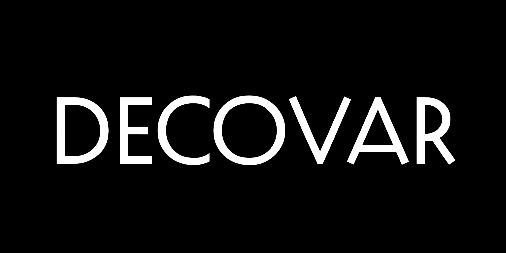

~~~
doc.title = 'The&nbsp;Variable&nbsp;Designer'

# Page (Home)
#	Wrapper
#		Header 
#			Logo (+BurgerButton)
#			Navigation/TopMenu/MenuItem(s)
#      Content
#  			Banner
#  			SlideShow (on Home)
#      		Slides
#      		SlideSide
#			Section(s)
#				Introduction
#				Main
#				Mains
#					Main
#				Side
#				Sides
#					Side
#		Footer
#
# ----------------------------------------
# Some general styles
from pagebot.toolbox.units import pt
doc.rootStyle['labelSize'] = pt(14)

# ----------------------------------------
# index.html
# ----------------------------------------
page.name = 'Home'
page.url = 'index.html'
content = page.select('Content')
box = content.newBanner()
~~~

# Practical guide for Variable Font design strategies

~~~
box = content.newIntroduction()
~~~

# Cases, best practices, opinions and optical size.

~~~
section = content.newSection()
box = section.newMain()
# TODO: Make automatic SiteMap Element, generating the linked list below
~~~

# Design paths for Variable Fonts

## Variable Fonts

* [4 masters 2 axes](design_space-4-masters-2-axis.html)
* [5 masters 2 axes](design_space-5-masters-2-axis.html)
* [9 masters 2 axes](design_space-9-masters-2-axis.html)
* Super-in-position
* Supporting masters
* [Parametric axes](design_space-parametric-axes.html)
* [Catalog axes](design_space-catalog-axes.html)
* Axes by hierarchy
* Independent axes
* Delta-absorbers
* Inline-axis masters
* Glyph replacement by OT-feature rules
* Extrapolated axes

## Traditional

* [“Simple” 2 masters 1 axis](design_space-2-masters-1-axis.html)
* [“Simple” 3 masters 1 axis](design_space-3-masters-1-axis.html)
* [4 masters 2 axes (Traditional Multiple Master)](design_space-4-masters-2-axis-mm.html)
* 8 masters 3 axes (Traditional Multiple Master)
* 27-masters-3-axes and beyond (How not to do it)
* 16 masters 4 axes (Traditional Multiple Master)
* 32 masters 5 axes and beyond (Traditional Multiple Master)
* Unstructured set of existing masters as start

# Example animations






































# Topology of the design space

## Axes

## Types of masters

## Estimating the volume of work

# Process

## Sketching the design space

## Exploding dimensions

## Keep it small, test modular, hide unused axes

## MutatorMath vs. Fonttools interpolation

## Managing inflections points

## Instances

## Features

## Spacing, groups and kerning

## Scripting production

## Do’s and don’ts

# Tools

## Skateboard

## Fonttools

## RoboFont

# Contact
